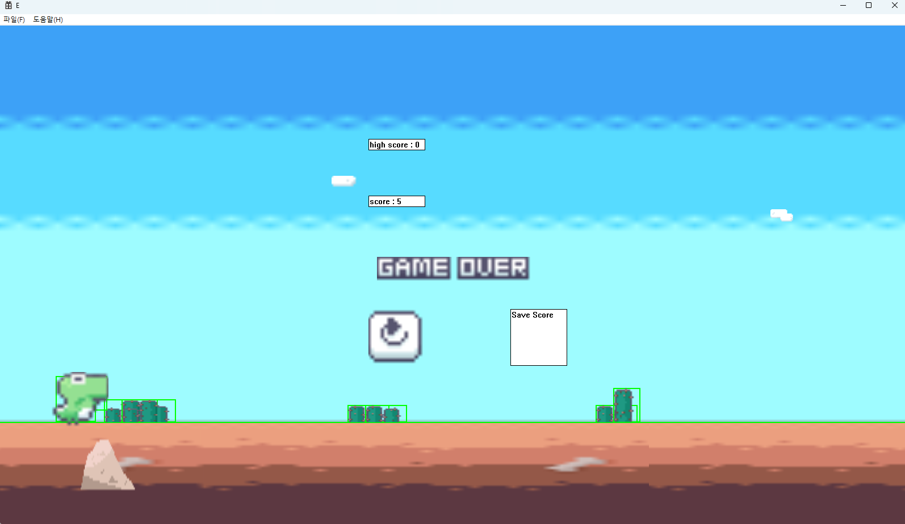
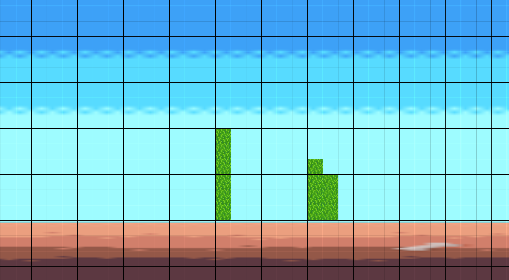

유니티엔진을 c++로 클론 코딩 후 만든 자체엔진을 기반으로 공룡게임을 클론코딩해봤습니다.

사용방법

1. mysql 8.0.33버전 설치, dinosaur데이터베이스 생성
2. java 21버전으로 dinosuar-server 폴더의 데이터베이스 서버 실행
3. x64/Realease폴더의 Editor_window.exe실행

구현 고려사항

1. player를 생성 후 카메라를 고정하고 랜덤 생성되는 장애물이 왼쪽으로 이동하게 한다.
2. player의 속도가 빨라짐에 따라 aabb충돌체크만으로는 부족하다고 판단해 swipe충돌방식으로 변경했습니다.
3. spring으로 간단한 score를 저장할 수 있는 데이터베이스 서버를 만들어 정보를 저장하고 불러올 수 있게했습니다.
   
4. Tool을 통해 장애물의 패턴을 설정할 수 있게 했습니다.
   
   장애물의 패턴을 생성하고 저장, 불러올 수 있습니다.
   "Tile"로 저장된 파일이 존재한다면 파일의 패턴으로, 없다면 랜덤으로 장애물을 생성합니다.

TODO LIST

- [x] UI button여러개 생성 가능하게 변경
- [x] 바닥, 배경등 sprite생성 후 불러오기
- [x] 바닥 반복되게 바꾸기
- [x] 선인장 object생성해서 script, collider 등 생성
- [x] 결과창, 다시 버튼 만들기

1차 피드백

- [x] 맵 리셋하면 속도 초기화하기
- [x] 속도 제한 걸기
- [x] 충돌체크 swipe로 변경하기
- [x] 속도가 증가해도 멀리있는 구름은 작게 가까운 선인장은 크게 속도 증가하게 하기
- [x] 시간 지남에 따라 점프 내려오는 속도 빠르게하기
- [x] 결과창, 점수 추가
- [x] player collider 2개 부여하게 하기
- [x] 선인장 생성 패턴을 생성하는 tool개발 후 파일 형식으로 저장 및 불러오기
- [x] spring으로 서버,db 달아서 network해보기

멀티 서버 추가

- [ ] 소켓통신
- [ ] 패킷 수신 후 브로드캐스트
- [ ] 게임오버 체크
- [ ] 클라이언트 측 충돌체크 전송
- [ ] 서버측 히트박스 축소
